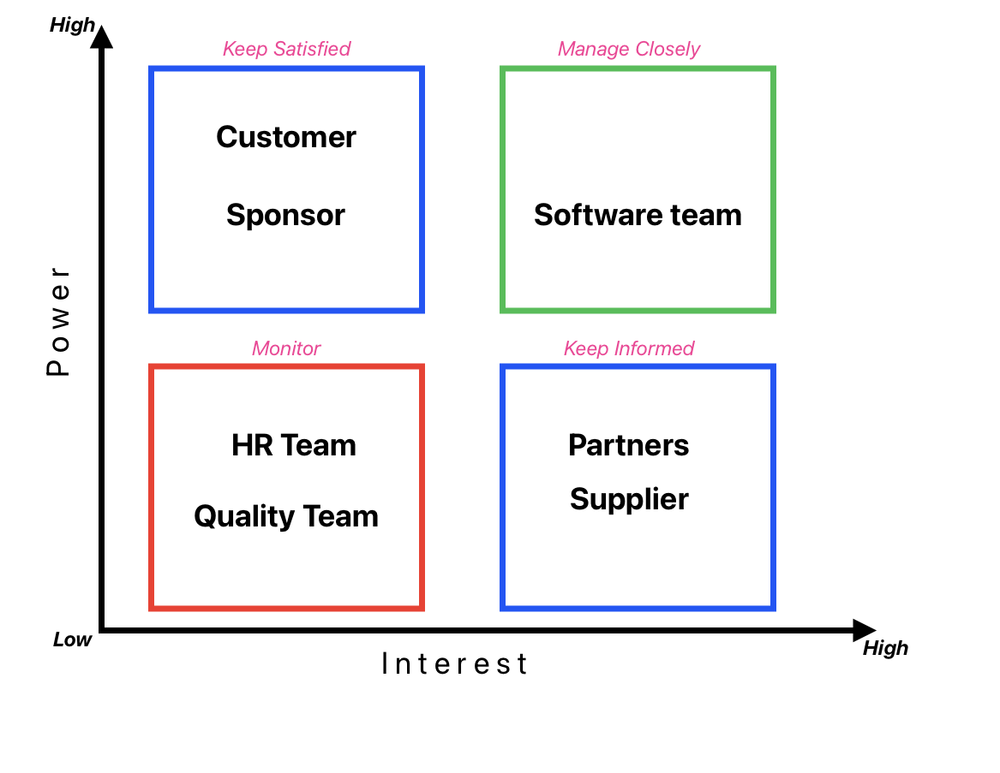

# Case Study: Stakeholder Engagement & Communication Plan

## Stakeholder analysis

## Stakeholder Engagement Matrix

| Stakeholder   | Unaware | Resistant | Neutral | Supportive | Leading |
| ------------- | :-----: | :-------: | :-----: | :--------: | :-----: |
| Sponsor       |         |           |         |     C      |    D    |
| Customer      |         |           |         |    C,D     |         |
| Partners      |    C    |           |         |     D      |         |
| Suppliers     |         |           |    C    |     D      |         |
| Software team |    C    |           |         |            |    D    |
| Quality team  |    C    |           |         |     D      |         |
| HR Team       |         |     C     |         |     D      |

## Stakeholder Communication Plan

| Purpose        | Responsibility |      Audience       | Medium  |      Content      |  Timing   |
| -------------- | :------------: | :-----------------: | :-----: | :---------------: | :-------: |
| Project Status |       PM       |  Customer,Sponsor   | Meeting | Status report, QA | Bi-weekly |
| Team Status    |       PM       |        Team         | Meeting | Status,Issus, QA  |  Weekly   |
| Project Review |       PM       | Partners, Suppliers | Meeting |  Project Status   |  Monthly  |
| Audit          |       QA       |      Team, PM       | Meeting |    Compliance     |  Monthly  |
