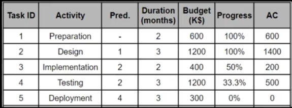
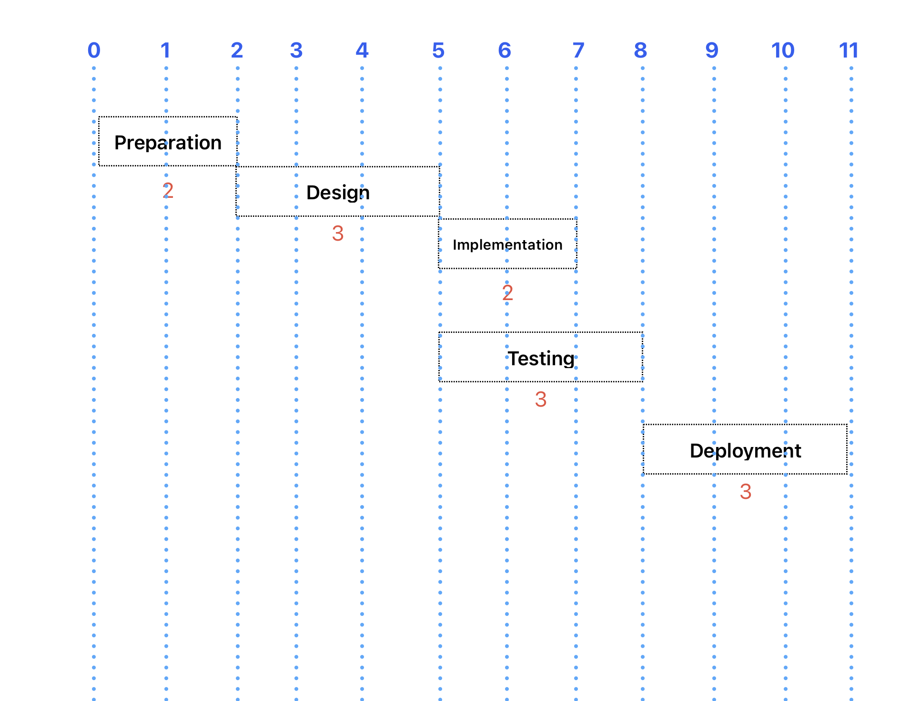

# EVM Case Study.

> BAC = 600 + 1200 + 400 + 1200 + 300 = 3700k

> AC = 600 + 1400 + 200 + 500 = 2700k

> EV = progress \* budget  
> 100% _ 600 = 600  
> 100% _ 1200 = 1200  
> 50% _ 400 = 200  
> 33.3% _ 1200 = 400  
> 0% \* 300 = 0  
> EV = 2400k

> PV = planned progress \* budget
> 100% _ 600 = 600  
> 100% _ 1200 = 1200  
> 100% _ 400 = 400  
> 66.6% _ 1200 = 800  
> 0% \* 300 = 0  
> PV = 3000k

> CV = EV - AC  
> CV = 2400k - 2700k = -300k

> SV = EV - PV  
> SV = 2400k - 3000k = -600k

> CPI = EV/AC  
> CPI = 2400k / 2700k = 88.89%

> SPI = EV / PV
> SPI = 2400 / 3000k = 80%

> EAC = BAC/CPI = 3700 / 88.89% = 4162k  
> EAC = AC + BAC-EV = 2700 + 3700 - 2400 = 4000k ( optimistic ).

## by how much, is it over/under budget ?

CV = -300k so it's under budget by 300k.

## by how many days is it ahead/behind the schedule?

As per the schedule diagram above, it's clear that the current progress is supposed to be the state of the project at 6th month not 7th.
so it's behind the schedule by **1 month**.

## by the end of the project, by how much will it be over / under budget ?

Base on EAC values, in optimal conditions it'll be under budget by 300k otherwise it'll be under budget by 462k.
